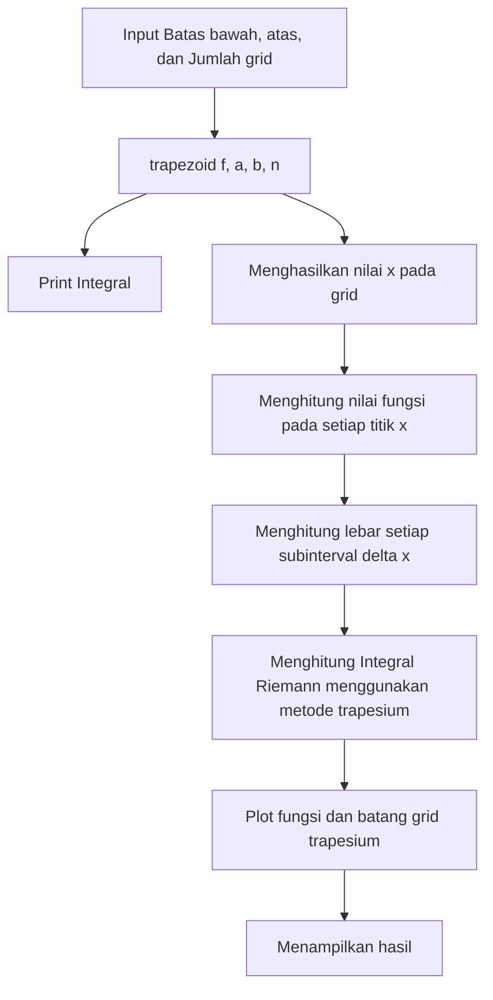

# Template_Prakfiskom
Repository ini hanya untuk template Praktikum Fisika Komputasi

```mermaid
graph TD
    A[Input Batas bawah, atas, dan Jumlah grid] --> B[trapezoid f, a, b, n]
    B --> C[Print Integral]
    B --> D[Menghasilkan nilai x pada grid]
    D --> E[Menghitung nilai fungsi pada setiap titik x]
    E --> F[Menghitung lebar setiap subinterval delta x]
    F --> G[Menghitung Integral Riemann menggunakan metode trapesium]
    G --> H[Plot fungsi dan batang grid trapesium]
    H --> I[Menampilkan hasil]
```
