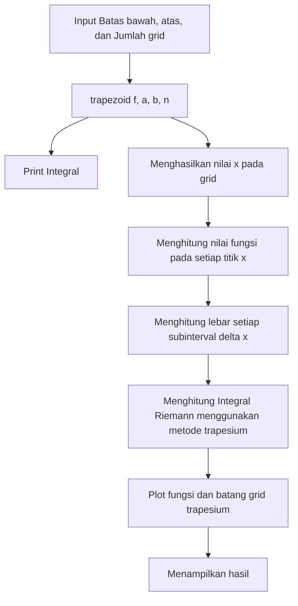

# Template_Prakfiskom
Repository ini hanya untuk template Praktikum Fisika Komputasi

Nama Kelompok :
Anggota Kelompok :
1. A
2. B
3. C
4. D
5. E

Project Metode Numerik
1. Integral Trapezoid Fungsi sin(x)
2. Integral Trapezoid Fungsi cos(x)

Berikut Flowchart Integral Trapezoid Fungsi sin(x)

Berikut Ilustrasi Integral Numerik Trapezoid Multigrid Fungsi Sin(x)

